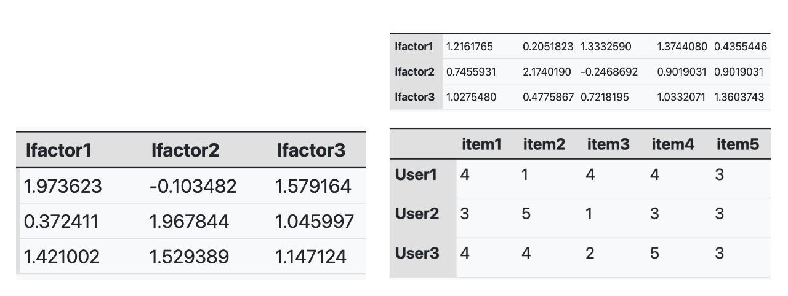

# Realization of A Funk SVD Based Music Recommendation

Yigang Meng

07/06/2023

## Introduction: Funk SVD - What's in it?

Funk SVD is an algorithm introduced by Simon Funk, which is a matrix factorization algorithm that can be used in giving recommended items to users. In this project, we will dive into several parts of it, which are the math behind the Funk SVD, the limitation of the traditional singular values decomposition in recommendation systems, the implementation including iteratively finding the constructing matrix using SGD(Stochastic gradient descent), and the comparison to the Funk SVD function from `recommenderlab`.

## Background: Why Funk SVD? (Why not SVD?)

Rating table are often sparse. And when it comes to a recommendation system, we really want to "fit" the missing values based on the ratings in the original matrix. Given a real matrix $R$ .The traditional SVD is given by:

$$
R=U \Sigma V^T
$$

, where $U$ is orthogonal whose columns are the left singular vectors of $R$ . $\Sigma$ is a diagonal matrix consists of the singular values, and $V^T$ is also orthogonal and its rows are the right singular vectors of $R$ .

While as we mentioned in the introduction, the traditional is naturally not able to handle the missing values, and it can be really computationally expensive. One want to do SVD on an incomplete matrix, one must fill out the data using other values such as global mean $\bar{X}$ . And then we can perform SVD to get the estimated $\hat{R}$.

Funk SVD is a model that has latent factors. Latent factors are implicitly defined by the model itself, and it's hard to interpret sometimes, but it can be really helpful in finding the underlying pattern that is driven by user-item matrices.(Figure1) One can think of latent factors as the "gradients" of the items, and we add different amount of each gradient to construct a portrait of a user.



A Funk SVD defined on a matrix $R_{m \times n}$ is as follow

$$
R\approx \mathrm{U} \mathrm{V}^{\mathrm{T}}
$$

where $U_{m \times k}$ and $V^T_{k \times n}$ are two low rank matrices which has the latent factors of the users and the items, respectively. Our goal is to find the $U_i$ and $V^T_j$ via minimizing the loss function:

$$
J(U_i, V^T_j)=\min \Sigma_{\mathrm{i}, \mathrm{j} \in \mathrm{train}}\left(\mathrm{R}_{\mathrm{ij}}-\mathrm{U}_{\mathrm{i}} \mathrm{V}_{\mathrm{j}}^{\mathrm{T}}\right)^2+\lambda\left(\left\|\mathrm{U}_{\mathrm{i}}\right\|^2+\left\|\mathrm{V}_{\mathrm{j}}^{\mathrm{T}}\right\|^2\right)
$$

, where $\lambda$ is the regularization parameter. (expalain what is regularization parameter). And we take the partial derivatives with respects to $U_i$ and $V^T_i$, respectively, we get:

$$
\frac{\partial J\left(U_i, V_j^T\right)}{\partial U_i}=\sum_{j \in \text { Train }}\left[-2\left(R_{i j}-U_i V_j^T\right) V_j^T\right]+2 \lambda U_i
$$

$$
\frac{\partial J\left(U_i, V_j^T\right)}{\partial V_j}=\sum_{i \in \text { Train }}\left[-2\left(R_{i j}-U_i V_j^T\right) U_i\right]+2 \lambda V_j
$$

In Stochastic gradient descent method, the hyper parameter $\alpha = 2c$ that is served as the how precisely we want to move in a direction. And one updates two variables along with the opposite of the gradient(Yadav, 2020) to find $U_i$ and $V^T_i$ :

$$
U_i \leftarrow U_i+\alpha \cdot\left(\left(R_{i j}-U_i V_j^T\right) V_j-2 \lambda U_i\right)
$$

$$
V_j \leftarrow V_j+\alpha \cdot\left(\left(R_{i j}-U_i V_j^T\right) U_i-2 \lambda V_j\right)
$$

## Perform on the Amazon digital music data base

### Computation:

#### Data importing, cleaning, and filtering

```{r}
library(dplyr)
library(tidyverse)
df <- read.csv("ratings_Digital_Music.csv")
colnames(df) <- c("user","item","rating")
df <- df[, -4]
# Filter out users with fewer than 10 ratings
df <- df %>% group_by(user) %>% filter(n() >= 30)

# Filter out items with fewer than 10 ratings
df <- df %>% group_by(item) %>% filter(n() >= 40)
user_item_matrix <- df %>%
  spread(key = item, value = rating)
```

```{r}
df1 <- as.data.frame(user_item_matrix)
rownames(df1) <- df1[,1]
df1 <- df1[,-1]
head(df1)
dim(df1)
R <- df1
colnames(R) <- NULL
rownames(R) <- NULL
dim(R)
R <- as.matrix(R)
```

#### **Split the data into training and testing sets**

We randomly hide 5 ratings from the matrix, thereby we can construct a training data set.

```{r}
n <- 5  # The number of ratings to hide per user
train_data <- R
test_data <- matrix(NA, nrow = nrow(R), ncol = ncol(R))

for (i in 1:nrow(R)) {
  rated_items <- which(!is.na(R[i, ]))
  if (length(rated_items) > n) {
    test_items <- sample(rated_items, n)
    test_data[i, test_items] <- R[i, test_items]
    train_data[i, test_items] <- NA
  }
}
```

#### Train on training data set

For the parameters, we want to get the optimal number of the latent factors with a small mean square error and smaller index(the number of factors also needs to be less than the number of columns as well). It is because we need to consider the trade-off between the accuracy and complexity, where we avoid the potential over-fitting of our model.

```{r}
set.seed(123)
n_users <- nrow(R)
n_items <- ncol(R)
learning_rate <- 0.01
n_epochs <- 100  
tolerance <- 1e-4  # Set a tolerance for the change in error
lambda <- 0.05  # Set the regularization parameter
errors <- c()  # Initialize a vector to store the errors
n_factors_range <- 2:16
mse_results <- c()
for (n_factors in n_factors_range) {
  
  P <- matrix(runif(n_users * n_factors), n_users, n_factors)
  Q <- matrix(runif(n_items * n_factors), n_items, n_factors)
  errors <- c()

  for (epoch in 1:n_epochs) {
    total_error <- 0
    for (i in 1:n_users) {
      for (j in 1:n_items) {
        if (!is.na(train_data[i, j])) {
          error <- train_data[i, j] - P[i, ] %*% Q[j, ]
          total_error <- total_error + error^2
          P[i, ] <- P[i, ] + learning_rate * (as.numeric(error) * Q[j, ] - lambda * P[i, ])
          Q[j, ] <- Q[j, ] + learning_rate * (as.numeric(error) * P[i, ] - lambda * Q[j, ])
        }
      }
    }
    errors <- c(errors, total_error)
    if (epoch > 1 && abs(errors[epoch] - errors[epoch-1]) < tolerance) {
      break
    }
  }

  R_hat <- P %*% t(Q)
  test_mse <- mean((test_data - R_hat)^2, na.rm = TRUE)
  mse_results <- c(mse_results, test_mse)
}

plot(n_factors_range, mse_results, type = 'b', xlab = 'Number of Factors', ylab = 'Test MSE', main = 'Test MSE vs. Number of Factors')
optimal_n_factors <- min(order(mse_results)[1:2])
```

#### Run the Funk SVD with the optimal number of latent factors

In the code chunk below, we inherent the optimal number of latent factors we got from above, and run the Funk SVD by epochs of 100. Moreover, we set a tolerance to end the calculation early when the error is smaller than it. This is a trade off between the time consumed and the accuracy, which will be furtherly discussed after. The time consumed is shown below.

```{r}
set.seed(123)
n_users <- nrow(R)
n_items <- ncol(R)
learning_rate <- 0.01
n_epochs <- 100  
tolerance <- 1e-4  # Set a tolerance for the change in error
gamma <- 0.01  # Set the regularization parameter
errors <- c()  # Initialize a vector to store the errors
n_factors <- optimal_n_factors

start_time <- Sys.time()
for (epoch in 1:n_epochs) {
    total_error <- 0  # Initialize the total error for this epoch

    for (i in 1:n_users) {
        for (j in 1:n_items) {
            if (!is.na(train_data[i, j])) {
                # Calculate the error
                error <- train_data[i, j] - P[i, ] %*% Q[j, ]
                # Add the squared error to the total error
                total_error <- total_error + error^2

                # Update P and Q matrices using gradient descent
                P[i, ] <- P[i, ] + learning_rate * (as.numeric(error) * Q[j, ] - gamma * P[i, ])
                Q[j, ] <- Q[j, ] + learning_rate * (as.numeric(error) * P[i, ] - gamma * Q[j, ])
            }
        }
    }

    # Store the total error for this epoch
    errors <- c(errors, total_error)

    # Check if the change in error is less than the tolerance
    if (epoch > 1 && abs(errors[epoch] - errors[epoch-1]) < tolerance) {
        break  # Stop training
    }
}

end_time <- Sys.time()
time_consumed <- end_time - start_time
print(time_consumed)
```

#### Calculate the MSE for the given model

We calculate the mean squares error between the test hat and the test data, and it's around 0.8, which is a acceptable result given that the rating spreads from 1 to 5.

```{r}
test_hat <- P %*% t(Q)

# Calculate the MSE on the test data
test_mse <- mean((test_data - test_hat)^2, na.rm = TRUE)
print(test_mse)
```

## Comparison

We now use the `funkSVD` function from `recommenderb` package, we get the test_hat_RCML and the MSE of it. Compared to our Funk SVD implementation, it consumed more time, but get a smaller MSE.

There are several reasons related to the result:

1.  The `funkSVD` function doesn't have a tolerance when iteratively finding $U$ and $V^T$ , and it may take more time but get a relatively accurate prediction.\
2.  The initialization of the user and item matrices is different where `funkSVD` use the default values of 0.1's for them, this might lead to the fact that it can somehow finding the global minima instead of local.
3.  The most possible reason is the convergence criteria. Inside of the `funkSVD`, the algorithm is still training until both conditions about the min_improvement and the min_epochs are met, which means that it will get more accurate result by making sure the number of epochs is always larger than the given one. And it further explain why it takes more time than ours in average.

```{r}
library(recommenderlab)

n_factors <- optimal_n_factors
start_time <- Sys.time()

result <- funkSVD(train_data, k = n_factors, lambda = 0.01, gamma = 0.01, min_epochs = 100, max_epochs = 100, verbose = FALSE)

end_time <- Sys.time()
time_consumed <- end_time - start_time
print(time_consumed)

test_hat_RCML <- result$U %*% t(result$V)
test_mse_RCML <- mean((test_data - test_hat_RCML)^2, na.rm = TRUE)
print(test_mse_RCML)
```

## Conclusion

In conclusion, we have explored the concept of Funk SVD, a matrix factorization algorithm used in recommendation systems. We began by comparing it to traditional SVD, highlighting the limitations of the latter in the context of recommendation systems. We then delved into the mathematics underpinning Funk SVD, explaining how it works and why it is effective for generating recommendations from a sparse user-item matrix.

We implemented the Funk SVD algorithm, focusing on the iterative process of finding the optimal matrices using Stochastic Gradient Descent (SGD). We also discussed how to determine the optimal number of factors.

Finally, we compared our implementation with the **`funkSVD`** function from the **`recommenderlab`** package. We found that while our implementation was able to achieve a reasonable MSE, the **`recommenderlab`** function achieved a lower MSE, possibly due to differences in the convergence criteria used in the training process.

## Reference

Gupta, P. (2017, November 16). *Regularization in machine learning*. Medium. <https://towardsdatascience.com/regularization-in-machine-learning-76441ddcf99a#:~:text=Regularization%2C%20significantly%20reduces%20the%20variance,impact%20on%20bias%20and%20variance.>

Improving regularized singular value decomposition for collaborative \... (n.d.). <https://www.cs.uic.edu/~liub/KDD-cup-2007/proceedings/Regular-Paterek.pdf>

Yadav, A. (2020, February 20). *Why we move opposite to gradients in gradient descent??*. Medium. <https://medium.com/analytics-vidhya/why-we-move-opposite-to-gradients-in-gradient-descent-9077b9aa68e4>

Zhang, Y. (2022, March 12). *An introduction to matrix factorization and factorization machines in recommendation system, and beyond*. arXiv.org. <https://arxiv.org/abs/2203.11026>
